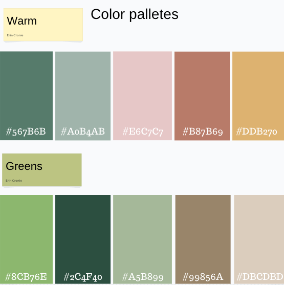

# Naramata Vineyard

## Overview

Explore the Naramata Vineyard website, designed as the operational center for our esteemed Bed & Breakfast, owned by my parents. This platform facilitates seamless booking processes for guests, reflecting a commitment to excellence in hospitality. Engage with an easy to use interface, ensuring a smooth experience for both guests and proprietors alike, as we invite you to discover the unparalleled charm of our B&B.

### Problem

In response to the increasing fees imposed by platforms like Airbnb and VRBO, my parents have chosen a new path outside of these services. This decision allows them greater control over their business operations, avoiding the escalating fees associated with booking platforms. Taking charge of their business gives my parents more freedom and create a guest experience that's more to their style.

### User Profile

Residing in a sought-after tourist destination, where demand for accommodations surges during the spring, summer, and early fall seasons, this initiative will play a pivotal role in facilitating lodging arrangements for guests exploring the Okanagan region.

Vacation planning and bookings can be stressful; my aim is to streamline this process for guests and alleviate the operational burden on my parents managing the business. The objective is to enhance overall efficiency and ensure a seamless experience for both travelers and proprietors alike.

### Features

1. **User-Friendly Booking Interface:**

   - Intuitive and easy-to-use booking system for guests.

2. **Calendar Management:**

   - A robust calendar system that allows hosts to manage room availability efficiently.

3. **Reviews and Ratings:**

   - A transparent feedback system enabling guests to leave reviews and ratings, fostering trust.

4. **Instant Booking:**

   - Option for instant bookings, providing convenience for guests and hosts.

5. **Secure Payment Processing:**

   - Reliable and secure payment processing for seamless transactions.

6. **Personalized Guest Experiences:**

   - Customization options for hosts to personalize guest experiences, such as welcome messages or local recommendations.

7. **Messaging System:**

   - In-app messaging system for easy communication between hosts and guests.

8. **Cancellations and Refunds:**

   - Clear policies regarding cancellations and refunds for both guests and hosts.

9. **Host Profiles:**

   - Detailed host profiles with information about the property, amenities, and local attractions.

10. **Localization Features:**

    - Language and currency localization for a global user base.

11. **Property Listings:**

    - Comprehensive property listings with high-quality images and detailed descriptions.

12. **Property Amenities and Policies:**

    - Clearly outlined amenities, house rules, and check-in/check-out procedures.

13. **Push Notifications:**

    - Notifications for booking confirmations, messages, and other relevant updates.

14. **Special Deals and Promotions:**
    - Feature for hosts to offer special deals or promotions during specific periods.

## Implementation

### Tech Stack

1. **Web Development:**

   - **Languages:** HTML, CSS, JavaScript
   - **Frameworks/Libraries:** React

2. **Backend Development:**

   - **Languages:** Node.js (JavaScript)
   - **Frameworks:** Express.js (Node.js)

3. **Database Management:**

   - **Databases:** MySQL
   - **Query Languages:** SQL

4. **APIs (Application Programming Interfaces):**

   - **RESTful APIs** for communication between different components of the system.

5. **Version Control:**

   - **Git** for tracking changes in codebase

6. **Security:**

   - **SSL/TLS** for secure communication

7. **Payment Gateways:**

   - Integration with payment gateways using their respective APIs.

Future features:

8. **Data Analytics and Business Intelligence:**

   - **Tools:** Google Analytics

9. **Cloud Computing:**

   - **Platforms:** Google Cloud Platform

10. **Machine Learning and Data Science (for personalized recommendations, pricing strategies, etc.):**

    - **Languages:** Possibly Python

11. **Mobile App Development:**

- **Languages:** React Native (cross-platform)

### Endpoints

Google Calendar API: The Google Calendar API is a RESTful API that can be accessed through explicit HTTP

[Google Dev docs for Node.js](https://developers.google.com/calendar/api/quickstart/nodejs)

Payment Authorization APIs:

Payment authorization APIs provided by payment gateways or financial institutions.
Authorization Process:

1. The application sends a request to the payment authorization API with transaction details.

2. The API responds with an authorization status and additional details.
   Fraud Detection and Prevention:

We have not yet found a payment provider we wish to use at this time

### Auth

Google Calendar API requires API authorization

### Payment Gateway Integration:

Description: Payment gateways are third-party services that handle the communication between the application, the user, and the financial institution.

### Authorization Process:

1. The user initiates a payment.

2. The application sends payment details (e.g., amount, card information) to the payment gateway.

3. The payment gateway processes the transaction with the relevant financial institution.

4. The result (authorization or decline) is sent back to the application.

### Tokenization:

Tokenization is the process of replacing sensitive payment information (e.g., credit card numbers) with a unique token. This token is used for transaction authorization.
Authorization Process:

1. Instead of storing actual card details, the application stores and uses a token generated by the payment gateway.

2. The token is used for subsequent transactions, reducing the risk associated with storing sensitive information.

### 3D Secure (3DS):

3D Secure is an additional layer of security for online credit and debit card transactions. It adds an extra authentication step, often involving a one-time password (OTP) or biometric verification.

### Authorization Process:

1. After submitting payment details, the user is redirected to a 3D Secure page for additional authentication.

2. The authentication response is sent back to the application for transaction authorization.

## Roadmap

The Okanagan is a seasonal destination, the website will need to be functioning with the basic booking components by Spring time, which will allow myself more time this winter to add more features.

two weeks time:

1. should have the main portion of the website, the designs with HTML and CSS

December:

1. Have booking calendar intergrated and functioning through APIs

2. Add weather API

3. Find safe payment payment processors to have the feature up and running

January:

1. Create database to hold booking details, customer accounts are not required at this time

2. Once payment processors, data base and calendar are functioning - guests will be able to book their reservations

3. Main booking communication with be through email for the first year

October 2024:

1. with the summer over, take the time to review how the summer went and any new features we may need. ie. will it be more benefical to have customer accounts?

## Nice-to-haves

Once our first season is complete, it will be a great time to reflect on what features the website may need for the next season:

1. Open Table (other booking systems) intergrations to book dining/event reservations online

2. More advanced messaging services for chats, such an an AI chat bot guests can communicate with before booking, and live chats/messages once guests book

3. Mobile App, once guests have paid for their reservation, a link to a private app would be sent via email. This app would allow them to have access to a private messaging service, online service booking, weather information, local activities etc..

## Design

